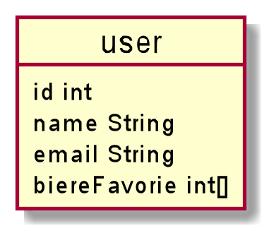
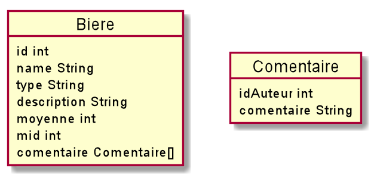
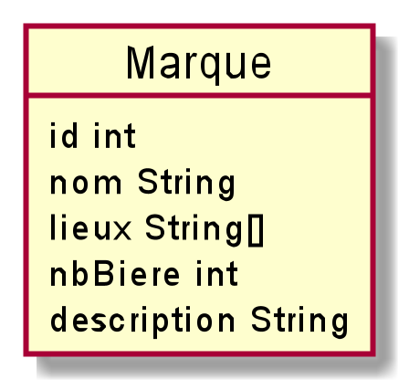

# :fire: :fire: :fire: Specification de la base de données Firebase :fire: :fire: :fire:

## :bow_and_arrow:  Objectifes de la BDD :bow_and_arrow:

La base de donnée auras pour but de sauvegarder les donners suivante :
* Les profiles utilisateur
* Les bières
* Les marques de bière

Pour ce projet nous avons choisis d'utiliser la console fierbase.  
Nous utiliserons donc le service d'authentification de fierbase.  
Cela nous permetra à ne pas à avoir a gérer les identifients des utilisateur.

La BDD fierbase est une base de donnée plat.  
Les collections seront donc représentées en `Json`.

:warning:

_Les exemples sont donnés  à titre indicatif,
il peut y avoir des changements entres les exemples et l'implementation_

_Dans les exemples qui suivront :_
* _uidx est un id utilisateur_
* _bidx est un id d'une biere_
* _midx est un id d'une marque de biere_

:warning:

## Utilisateur :person_with_blond_hair:

Chaque utilisateur authentifié a un Firebase `uid` qui est  
unique parmi tous les fournisseurs et est retourné dans le  
résultat de chaque méthode d'authentification.

```json
{
    "users":{ // Colection Users
      "uid1":{ // ID de l'utilisateur
      //  si id est un string pour cette exemple au finale ce sera un uuid
        "name": "toto", // Nom  de l'utilisateur 
        "email": "toto@toto.gouv", // email de contacte 
        "biere_favorie": [ // liste des id des biere fav de l'utilisateur 
            "bid1",
            "bid7"
        ]
      }
    },
    "uid2": {
    
    }
}
```

 \ _representation de l'objet user_

## Bières :beer:

Les bières seront identifiées  par un ID.  
Chaque bière sera définie par
plusieurs caractéristiques.  
Elle aura une liste de commentaires (voir schéma objet ci-dessous).  
Pour le moment, il n'aura pas de suivi dans les commentaires.  
Un commentaire ne pourra pas répondre directement à un autre commentaire.

Chaque bières aura aussi un id de marque `mid` pour le relier à une marque de bière.

```json
{
    "biers":{ // Colection Bière
      "bid1":{ // Id de la bière
      // si id est un string pour cette exemple au finale ce sera un uuid
        "name": "la bête", // nom de la bière
        "type": "Ambre", // Type de la bière
        "description": "TODO", // Description de la bière
        "moyenne": 2.5, // Note sur 5 de la bière
        "mid": "mid7", // Id de ma marque qui fabrique cette bière
        "comentaire":[{ // liste des commentaire 
          "uid":1, // id de l'utilisateur qui a ecrit ce commentaire
          "commentaire":"TODO" // commentaire
        }]
      }
    },
    "bid2": {
  
    }
}
```

  
_Representation de l'objet Bière_

## Marque :alembic:

Une marque de bière est la marque qui fabrique une bière.  
Une marque sera définie par son id `mid`.  
Une marque pourra fabriquer plusieurs bières.  
Une marque peut avoir une ou plusieurs brasseries.  
Ces brasseries seront stockées dans une liste.

```json
{
  "marque": {
    "mid1":{ // Id de la marque
      // si id est un string pour cette exemple au finale ce sera un uuid
      "name": "TODO", // nom  de la marque 
      "Lieux": ["@ braserie 1"], // liste des adds des braserie
      "nbBiere":1, // nombre de bière que la marque propose
      "description":"TODO" // description
    }
  }
}
```


