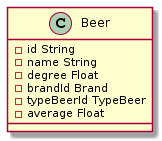
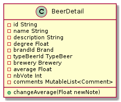
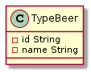
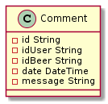
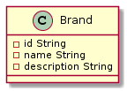
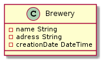
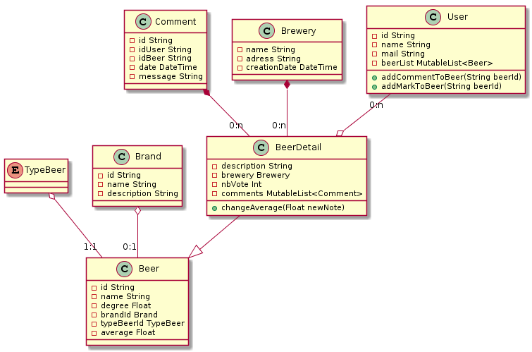

# Spécification Models 

## 🏗️ Objectifs 🏗️

Les modèles permettent une représentationt des objets implémentés dans le code.  
Ces représentations représente l'implementation coté client,   
les objets n'auront pas la même implémentation en base de donnée.

## ✏️ Spécifications ✏️

### 🧑 Utilisateur 🧑

L'utilisateur est definie par :
* un id
* un nom
* une @mail
* une liste de bières favorites

L'utilisateur peut :

* Manipuler sa liste de bières favorites (add/delete)
* Ajouter un commentaire à une bière
* Noter une bière

Uml :

### 🍺 Bière 🍺

Une bière est definie par :
* un id
* un nom
* un type
* une description
* un degrès d'alcool
* une marque
* une brasserie
* une moyenne
* nombre de personne qui on votés
* une liste de commentaires

Une bière peux :
* Mettre a jour sa moyenne

Il existe deux classes bière, la première qui contient les informations essentiels à l'affiche d'une bière dans la liste de bière(**class Beer**) et la deuxième pour afficher le détail d'une bière(**class BeerDetail**)

**Uml Beer:**

**Uml BeerDetail:**

### Type de bière

Type bière est un enum(ex:Blonde,Brune,Ambrée)

**Uml :**

### 💬 Commentaire 💬

Un commentaire est défini par:
* un id
* un id utilisateur
* un id de bière
* une date de poste
* un message

**Uml :**

### ©️ Marque ©️

Une marque est definie par :

* un id
* un nom
* une description

**Uml :**

### ⚗️ Brasserie ⚗️

Une brasserie est définie par:

* un nom
* une description

**Uml :**

## Uml de classe dans l'application

