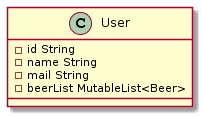
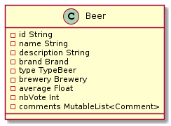
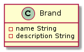
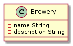
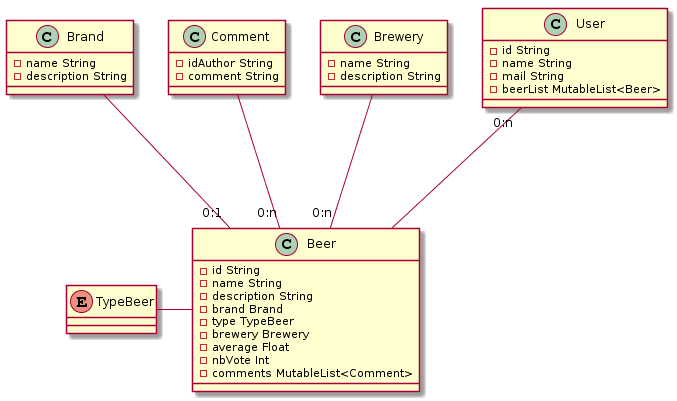

# Spécification Models 

## 🏗️ Objectifs 🏗️

Les modèles permettent une représentationt des objets implémentés dans le code.  
Ces représentations représente l'implementation coté client,   
les objets n'auront pas la même implémentation en base de donnée.

## ✏️ Spécifications ✏️

### 🧑 Utilisateur 🧑

L'utilisateur est definie par :
* un ID
* un nom
* une @mail
* une liste de bières favorites

L'utilisateur peux :

* Manipuler sa liste de bières favorites (add/update/delete)
* Ajouter un commentaire a une biere
* Noter une Biere

Uml :

### 🍺 Bière 🍺

Une bière est  definie par :
* un ID
* un nom
* un type
* une description
* une marque
* une brasserie
* une moyenne
* nombre de personne qui on voter
* une liste de commentaire

Une bière peux :
* Metre a jour sa moyenne

**Uml :**

### ©️ Marque ©️

Une marque est definie par :

* un nom
* une description

**Uml :**

### Brasserie

Une brasserie est définie par:

* un nom
* une description

**Uml :**

## Uml de classe dans l'application

