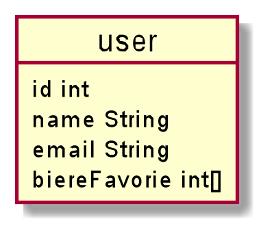
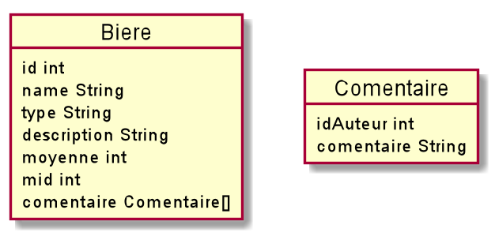

# Specification de la base de données Firebase

## Objectifes de la BDD

La base de donnée auras pour but de sauvegarder les donners suivante :
* Les profiles utilisateur
* Les bierers
* Les marques de bieres

Pour ce projet nous avons choisis d'utiliser la console fierbase.
Nous utiliserons le service d'authentification de fierbase, nous norons donc pas a gére les identifient des utilisateur.

 _Dans les exemples qui suivront :_
* _uidx est un id utilisateur_
* _bidx est un id d'une biere_
*  _midx est un id d'une marque de biere_

## Utilisateur

Chaque utilisateur authentifié a un Firebase `uid` qui est  
unique parmi tous les fournisseurs et est retourné dans le  
 résultat de chaque méthode d'authentification.

 \
_representation de la classe user_

```json
{
    "users":{
      "uid1":{
        "name": "toto",
        "email": "toto@toto.gouv",
        "biere_favorie": [
            "bid1",
            "bid7"
        ]
      }
    },
    "uid2": {
    
    }
}
```

## Bieres



```json
{
    "biers":{
      "bid1":{
        "name": "la bête",
        "type": "Ambre",
        "description": "TODO",
        "moyenne": 2.5,
        "mid": "mid7",
        "comentaire":[{
          "uid":1,
          "commentaire":"TODO"
        }]
      }
    },
    "bid2": {
  
    }
}
```


